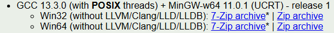
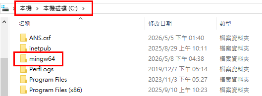
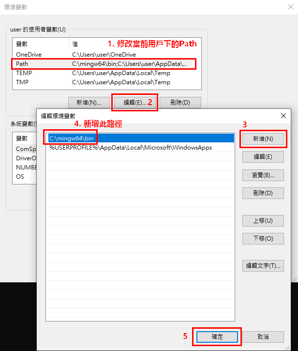
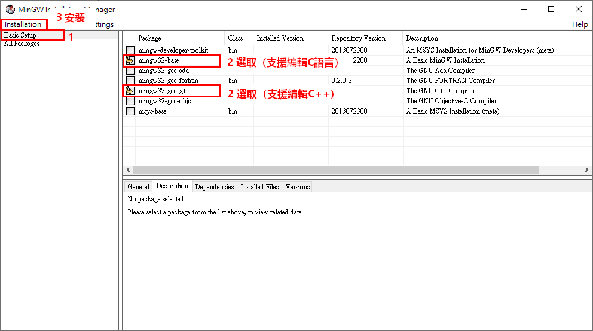
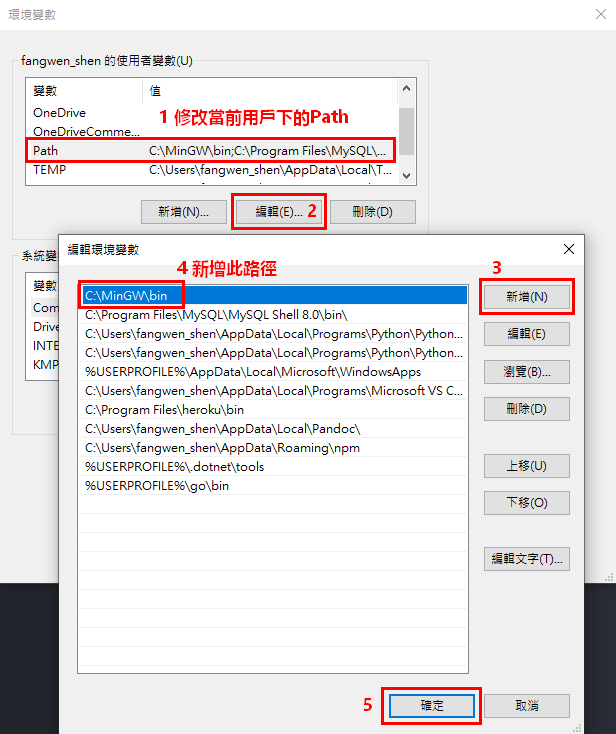

# 安裝編譯器/直譯器

| 程式語言 | 環境建置       | CJ目前使用版本 | 檢查安裝版本指令 |
| ------- | -------------  | ----- | ---|
| C       | 需安裝 [GCC](https://winlibs.com/) | gcc 13.3.0 | gcc -v |
| C++     | 需安裝 [G++](https://winlibs.com/) | g++ 13.3.0 | g++ -v |
| C#      | 需安裝 [.Net](https://dotnet.microsoft.com/en-us/download) | C# 14.0 with .NET 10 runtime | dotnet --list-runtimes |
| Go      | 需安裝 [Go](https://go.dev/) | go 1.22.2 amd64 | go version |
| Java    | 需安裝 [JDK](https://www.oracle.com/tw/java/technologies/downloads/#jdk25-windows) | java 25.0.1 | java -version |
| Python  | 需安裝 [Python](https://www.python.org/downloads/windows/) | python 3.12.12 | python -V 或  python --version |

如在終端機或命令提示字元(cmd)，輸入表格中「檢查安裝版本指令」，有出現相關說明或version版本等訊息，即為安裝成功且可查看安裝版本資訊。

## GCC/G++安裝說明

### 1. 使用 WinLibs（各版本皆可安裝）

1-1. 開啟 [WinLibs](https://winlibs.com/)，進入頁面後，點擊欲安裝的GCC版本進行下載，並將下載後的解壓縮檔案置於C槽根目錄中。

1-2. 安裝完成後，需手動配置Path環境變數，進入【控制台】>【系統】>【系統資訊】>【進階系統設定】，在「系統內容」中選擇設定「環境變數」。並在當前用戶下的Path新增「C:\mingw64\bin」路徑，即完成GCC編輯環境建置。

### 2. 使用 MinGW（安裝版本為6.3.0）

2-1. 開啟 [MinGW](https://sourceforge.net/projects/mingw/) 並安裝後，進入介面，選擇安裝C語言及C++編輯環境，點擊「Installation」開始安裝。

2-2. 安裝完成後，需手動配置Path環境變數，進入【控制台】>【系統】>【系統資訊】>【進階系統設定】，在「系統內容」中選擇設定「環境變數」。並在當前用戶下的Path新增「C:\MinGW\bin」路徑，即完成GCC編輯環境建置。

